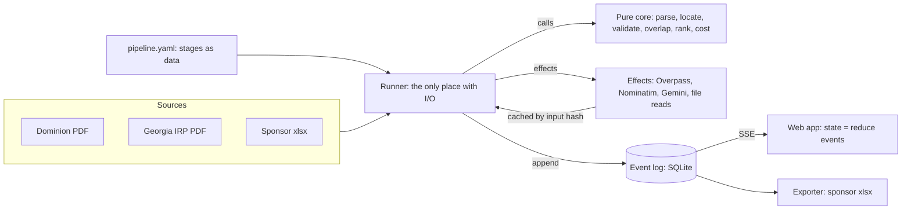

# Tandem — Implementation Plan (Handoff)

Sep 26, 2026 · @Eduardo Goncalvez

## Purpose and how to use this plan

Build Tandem as a declarative, event-sourced pipeline with a pure functional core, reproducing the published artifact on real data first, then replacing its shortcuts with real agents. The coding agent's first job is the scaffold in "Repository layout" and milestone M0; everything after follows the milestones in order.

Tandem ingests Dominion Energy South Carolina's and Georgia Power's public transmission filings, places every planned project on a map, and flags pairs under 25 miles apart, ranked with their gap in days. It is our entry for Sperry Tech's Gridlock challenge at ShellHacks 2026.

The artifact (Tandem on real filings) is the reference for behavior and look. It already proves three things the build must keep: all 44 Dominion and 208 Georgia projects parse from the PDFs, the six sponsor reference overlaps reproduce exactly, and the validator finds 17 real data issues. Its shortcuts are listed so they are not copied:

- The agents are a scripted animation; in the build they are real stages emitting real events.
- Locations come from the sponsor sample plus a town gazetteer; in the build they come from OpenStreetMap Overpass first.
- Briefs and cost ranges are templates; in the build an LLM writes them from extracted fields, with cited assumptions.
- All data is baked into one HTML file; in the build it flows from an API.

Inputs the agent receives with this plan: the two source PDFs and `Projects_Overlaps.xlsx` (sponsor sample and golden test) in `data/sources/`, committed with their original filenames; `Finding_Real_Locations_Guide.docx`, the challenge brief, and the artifact's HTML as a UI reference in `docs/reference/`; and the SC/GA GeoNames gazetteer in `data/reference/`, produced by `scripts/fetch_gazetteer.py`.

## Functional requirements

Each requirement is testable and maps to a Sperry deliverable (R = required, B = bonus) or to our differentiator (D).

| ID | Requirement | Acceptance check | Source |
| --- | --- | --- | --- |
| FR-1 | Ingest the Dominion PDF into project records: ID, name, description, need, status, in-service date, yearly costs 2024–2028, total, page | 44 records; every field present or flagged | R |
| FR-2 | Ingest Georgia's ten-year plan: table rows (zone, year, TEAMS number, name, need date, sponsor) joined to each project page (start date, need date, description, page). The page's need date wins; a mismatch with the table raises V-15 | 208 records; 0 table rows without a detail page | R |
| FR-3 | Ingest the sponsor sample (10 projects, 6 overlaps) as reference data and verified coordinates | Both sheets load; mixed date types normalized | R |
| FR-4 | Split each project into up to two named endpoints and locate each | Every endpoint has a location or an explicit "not located" reason | R |
| FR-5 | Locate endpoints in priority order: sponsor coordinates, OpenStreetMap Overpass (substation by operator and name), Nominatim, town gazetteer (GeoNames, `data/reference/geonames_sc_ga.csv`) | Each location records method, confidence, and evidence | R |
| FR-6 | Compute a project center: midpoint of the two located endpoints, else the single located point | Matches the sponsor sample centers exactly | R |
| FR-7 | Flag a pair as an overlap when the center-to-center haversine distance is under 25 miles; only utility pairs declared in `pairs` are compared | Reproduces all 6 sponsor overlaps | R |
| FR-8 | Record time gap as absolute days between the two projects' `in_service` dates; each source declares which parsed field that is (Dominion: in-service, Georgia: need date). Only full dates are used | Matches sponsor day gaps exactly | R |
| FR-9 | Show both utilities' projects on a pannable, zoomable map; click a project for details | Works with mouse, touch, and keyboard | R |
| FR-10 | Show a ranked list of overlaps, sortable by distance and by time gap | Default sort: distance, then gap | R |
| FR-11 | Filters: Georgia sponsor set (default GPC + SAV), location confidence, hide finished projects | List, map, and counts update together | R |
| FR-12 | Opportunity detail: distance, gap, build windows, filing text, costs, confidence, provenance, and a plain-language read of what can be shared | Every number traces to a source field | R |
| FR-13 | Cost/impact estimate for flagged pairs, using Dominion's public costs and cited assumptions | Assumptions and sources shown next to the figure | B |
| FR-14 | Validation checks run on every record and surface with severity, detail, and source location | The 17 known issues in the artifact are found | D |
| FR-15 | Reference check: re-derive the sponsor's 6 overlaps and show pass/fail per pair | Visible panel; fails the build if not 6/6 | D |
| FR-16 | Live pipeline view: stages, agents, counts, and activity driven by real events | UI state is derived only from the event stream | D |
| FR-17 | Replay any past run from its event log at 1×–10× speed | A recorded run replays with no network | D |
| FR-18 | Export the result in the sponsor schema (projects and overlaps sheets) plus data checks, reference test, and notes sheets | Opens in Excel; sponsor columns in sponsor order | R |
| FR-19 | Re-run on a new filing and show what changed: new, removed, and moved overlaps | Diff view between two runs | D |
| FR-20 | Agent-written briefs per top opportunity: each utility's position and a mediator summary, from extracted fields only | Every claim cites a field; no invented figures | D |

## Non-functional requirements

Correctness and traceability come first, because Sperry's AI team judges data pipelines for a living; visual polish comes after.

| ID | Quality | Target | How it is verified |
| --- | --- | --- | --- |
| NFR-1 | Correctness | Sponsor reference: distance within 0.01 mi and gap within 0 days on all 6 pairs | Golden test in CI; build fails otherwise |
| NFR-2 | Determinism | Same inputs and config produce byte-identical outputs; LLM responses cached by content hash. Output hashes are computed over canonical JSON (sorted keys) of the folded RunState plus the exported sheets, excluding `ts`, `duration_ms`, `run_id`, and any other timing fields | Run twice, diff the output hashes |
| NFR-3 | Traceability | Every derived value links to its source file, page, and the stage that produced it | Provenance field required by schema |
| NFR-4 | Purity | Parsing, geometry, validation, ranking, and cost math are pure functions with no I/O | Core package imports no network, file, or clock modules |
| NFR-5 | Performance | Full deterministic run under 60 s cold; overlap recompute under 100 ms for 300 projects; map holds 60 fps at 500 features | Timings logged per stage; browser profiler |
| NFR-6 | Demo resilience | Any stage that exceeds its timeout falls back to its last recorded output; the demo never blocks on the network | Kill the network mid-run; the run completes from cache |
| NFR-7 | Compliance | Public filings only; never use or reconstruct redacted or CEII-marked values; no secrets in the browser | Review checklist; API keys only server-side |
| NFR-8 | Accessibility | Keyboard reachable controls, visible focus, 4.5:1 text contrast, reduced-motion support, light and dark themes | Axe scan plus a keyboard-only walkthrough |
| NFR-9 | Portability | One command starts everything locally | `docker compose up` or `make dev` on a clean machine |
| NFR-10 | Cost | Free tiers only during the hackathon | No paid service in the default config |
| NFR-11 | Extensibility | Adding a third utility or a new rule is a config and a pure function, not a code change in the runner. Utility ids, comparison pairs, and each source's `in_service` field are declared in `pipeline.yaml`; parsers stay per source | Add a stub source in a test without touching the runner |

## Architecture

The pipeline is data, the logic is pure functions, and every side effect happens in one small runner that turns effects into events. The UI never asks "what is the state?"; it folds the event stream into state, which gives live view, replay, and diff from one mechanism.



Four principles the code must follow:

1. **Declarative pipeline.** Stages, their inputs, outputs, agent, timeout, and fallback live in `pipeline.yaml`. The runner reads it and executes a DAG; adding a stage never edits the runner.
2. **Functional core, imperative shell.** Core functions take immutable records and return new records plus a list of checks. They never read files, call the network, or look at the clock ("today" is a run parameter).
3. **Effects as values.** A stage that needs the outside world returns an effect request (for example `OverpassQuery(operator, bbox)`). The runner executes it, caches the result by a hash of the request, and feeds it back. This makes LLM and geocoding calls replayable and testable with fixtures.
4. **Event sourcing.** Every meaningful step appends an event. Run state, UI state, and the diff between runs are all folds over events. Replay is re-emitting a stored log on a timer.

Agents are stages whose effect is an LLM call with structured output. They are used only where judgment is needed: resolving an endpoint when Overpass returns several candidates, and writing briefs. LLM extraction when the deterministic parser fails is deferred (ADR-007): an unparseable page raises an error Check and its record is skipped. Distance, gaps, tiers, and ranking are always plain code.

## Stack

Python owns the pipeline because PDF parsing, geometry, and spreadsheets are strongest there; TypeScript owns the UI. Shared types are generated from one schema so the two never drift. Every tool and library uses its current stable release, with exact versions pinned in the lockfiles (`uv.lock`, `pnpm-lock.yaml`); version numbers below are the ones the plan was written against, not constraints.

**Use now**

| Layer | Choice | Why now | Replace when |
| --- | --- | --- | --- |
| Pipeline language | Python 3.12, Pydantic v2 (frozen models) | Parsers and geometry already proven in Python; immutable records fit the pure core | Never for this project |
| PDF text | `pdftotext -layout` (poppler) via subprocess, pdfplumber as fallback | The artifact parsed both PDFs completely with it | A filing arrives as a scan (then add OCR) |
| Geometry | shapely + pyproj; haversine for the official metric | Center-to-center haversine is the sponsor rule; shapely adds closest-point as an extra column | — |
| Geocoding | Overpass API (public endpoint, exponential backoff), Nominatim (at most 1 request/s, descriptive User-Agent with contact email from env), GeoNames cities1000 filtered to SC and GA as last resort; every response cached | Sperry's guide recommends Overpass and Nominatim | Rate limits hit during the event (then pre-fetch per operator) |
| LLM | Gemini API with JSON schema output, through LiteLLM; model from `llm.model` in `pipeline.yaml` (`gemini-flash-latest`, an alias to the latest Flash release), overridable by `GEMINI_MODEL` to pin an exact model ID | Native PDF input, structured output, MLH Gemini prize, LiteLLM already in our prototype | — |
| API | FastAPI with Server-Sent Events | One-way event stream is all the UI needs; SSE is simpler than WebSockets | The UI needs to send live commands mid-run |
| Storage | SQLite: `runs`, `events`, `effect_cache` tables | Zero setup, one file, easy to ship recorded runs for replay | More than one concurrent user (then Postgres) |
| Web | Next.js 15 (App Router), React, TypeScript | Team's strongest stack | — |
| Map | MapLibre GL with the OpenFreeMap style (no key; style URL in web config, never in components); deck.gl layers for pins, lines, and overlap links | Real basemap, WebGL speed, free | — |
| UI state | `useReducer` over events, Zustand only for view state (filters, selection) | State as a fold of events is the design | — |
| Contracts | JSON Schema exported from Pydantic, TypeScript types generated with json-schema-to-typescript | Single source of truth for events and records | — |
| Export | openpyxl | Sponsor schema already produced by the artifact's script | — |
| Tests | pytest, Hypothesis, vitest, Playwright | Golden test, property tests for geometry, reducer contract tests, one end-to-end replay test | — |
| Dev | uv, pnpm, Docker Compose, Make, GitHub Actions | One-command start; CI on every push and pull request | — |

**Add later**

- **Postgres (Tiger Data)** when a second concurrent user or run history beyond 50 runs is needed; also unlocks the MLH Tiger Data prize.
- **DigitalOcean App Platform** when the UI must be reachable by judges from their own devices.
- **PostGIS** when the project count passes 5,000 or spatial joins move into SQL.

**Don't use now**

- **Kafka, Redis, Celery.** One process with an async runner handles one run of about 250 projects. Reconsider above 10 concurrent runs.
- **LangChain or agent frameworks.** Stages are plain functions plus one LLM call each; a framework hides the event contract. Reconsider if agents need multi-turn tool use.
- **Microservices.** Four people, 36 hours. Reconsider never for this event.
- **Vector database or RAG.** The filings are small enough to parse deterministically. Reconsider if we add hundreds of utilities' filings.

## Repository layout

One monorepo with a pure core package, a thin runner, an API, and a web app; the scaffold creates every folder below with a README stub and one passing test. The repository root is `tandem/`; there is no subfolder.

```text
tandem/
  pipeline.yaml                 # stages as data (see Pipeline spec)
  .github/workflows/ci.yml      # GitHub Actions: lint, types, tests per package
  data/
    sources/                    # the two PDFs + Projects_Overlaps.xlsx, committed as-is, original filenames
    reference/                  # geonames_sc_ga.csv + README.md with GeoNames CC BY 4.0 attribution
    fixtures/                   # cached effect results for offline tests and replay
    runs/                       # recorded event logs for demo fallback
  packages/
    core/                       # PURE: no I/O, no clock, no network
      tandem_core/
        models.py               # Pydantic frozen records
        parse_desc.py           # text -> Project[]
        parse_georgia.py        # text -> Project[]
        parse_reference.py      # rows -> ReferenceSet
        endpoints.py            # name -> Endpoint[]
        locate.py               # candidates -> Location (pure choice logic)
        geometry.py             # centers, haversine, closest point
        validate/               # one module per rule, registry in __init__
        dates.py                # date normalization rules (see Pipeline spec)
        overlap.py              # projects -> Overlap[], reference test
        rank.py                 # overlaps -> Opportunity[]
        cost.py                 # Opportunity -> CostEstimate (cited assumptions)
        briefs.py               # Opportunity -> prompt; LLM output -> Brief (citation check); template Brief
        reduce.py               # events -> RunState (mirrors the web reducer)
        diff.py                 # RunState x RunState -> changes (added, removed, moved overlaps and projects)
      tests/
    contracts/
      schema/                   # JSON Schema exported from core models
      ts/                       # generated TypeScript types (do not edit)
  services/
    runner/                     # IMPERATIVE SHELL: reads pipeline.yaml, runs DAG, executes effects
      tandem_runner/
        dag.py
        effects/                # overpass.py, nominatim.py, gemini.py, files.py
        cache.py                # effect_cache by request hash
        events.py               # append + publish
    api/                        # FastAPI: runs, events (SSE), exports
  apps/
    web/                        # Next.js
      app/                      # routes: / (live), /runs/[id], /runs/[id]/diff/[other]
      components/               # Map, PipelinePanel, OpportunityList, OpportunityDetail, ChecksPanel, ReferencePanel
      lib/reducer.ts            # events -> UiState (pure)
      lib/selectors.ts          # filters, sorting (pure)
      lib/config.ts             # basemap style URL (OpenFreeMap) and other web config
  scripts/                      # export_schema.py, gen_types.sh, record_run.py, fetch_gazetteer.py
  docs/
    architecture.md             # this plan's decisions, kept current
    reference/                  # locations guide, challenge brief, artifact HTML (read-only inputs)
  CLAUDE.md                     # agent rules (see last section)
  Makefile  docker-compose.yml  .env.example
```

## Domain model and event contract

Six core records, their supporting models, and ten event types are the whole contract; the scaffold defines them all first and generates the TypeScript from them.

```python
Confidence = Literal["verified", "high", "town", "low"]   # strongest to weakest

class Provenance(Frozen):
    file: str                 # "2025 IRP Volume 3 PUBLIC DISCLOSURE.pdf"
    page: int | None
    locator: str              # "ID 06367 D-G" or "TEAMS 20277, zone 219"
    stage: str                # stage id that produced the value

class Location(Frozen):
    lat: float; lon: float
    method: Literal["sponsor", "overpass", "nominatim", "town", "agent"]
    confidence: Confidence
    evidence: str             # OSM id, query, or reason

class Endpoint(Frozen):
    raw_name: str; name: str
    location: Location | None
    unlocated_reason: str | None

class Project(Frozen):
    id: str                   # "DESC-06367D-G" | "GA-20277"
    utility: str              # a utility id declared under `utilities:` in pipeline.yaml
    sponsor: str              # DESC | GPC | SAV | GTC | MEAG | DU
    name: str; description: str; status: str | None
    in_service: date          # the source's declared in_service field (Dominion in-service, Georgia need date)
    build_start: date | None  # informational only: first spend year (Dominion) or start date (Georgia)
    cost_total: int | None; cost_by_year: dict[str, int] | None
    length_mi: float | None
    endpoints: tuple[Endpoint, ...]
    center: tuple[float, float] | None
    confidence: Confidence | None   # weakest of the located endpoints; None if none located
    partial_location: bool          # True when any endpoint is unlocated
    provenance: Provenance

class Overlap(Frozen):
    id: str; a: str; b: str   # project ids; a belongs to the first utility of its pair
    distance_mi: float        # center to center, haversine, 2 decimals
    closest_mi: float | None  # extra: nearest points of lines
    gap_days: int
    windows_overlap: bool
    confidence: Confidence    # weaker of the two projects
    in_reference: bool

class Check(Frozen):
    rule_id: str; severity: Literal["error", "warn", "info"]
    subject: str              # project id or file
    message: str; provenance: Provenance
```

Supporting models, also frozen and defined in M0:

```python
class ReferenceSet(Frozen):
    projects: tuple[Project, ...]
    overlaps: tuple[Overlap, ...]
    verified_coords: dict[str, tuple[float, float]]   # endpoint name -> (lat, lon)

class ReferenceResult(Frozen):
    pair: tuple[str, str]
    expected_mi: float; actual_mi: float | None
    expected_days: int; actual_days: int | None
    passed: bool

class CostAssumption(Frozen):
    name: str; value: float | str; source: str; url: str | None

class CostEstimate(Frozen):
    low: int; high: int; currency: str   # "USD"
    assumptions: tuple[CostAssumption, ...]

class Brief(Frozen):
    dominion_position: str; georgia_position: str; mediator_summary: str
    shareable: tuple[str, ...]
    cited_fields: tuple[str, ...]        # "<project id>.<field>"
    source: Literal["llm", "template"]

class Opportunity(Frozen):
    overlap: Overlap; rank: int; windows_overlap: bool
    cost_estimate: CostEstimate | None
    brief: Brief | None

class RunState(Frozen):
    run_id: str; status: Literal["running", "completed", "failed"]
    stages: dict[str, StageState]        # status, counts, used_fallback
    projects: dict[str, Project]
    checks: tuple[Check, ...]
    overlaps: dict[str, Overlap]
    reference_results: tuple[ReferenceResult, ...]
    opportunities: tuple[Opportunity, ...]
    totals: dict[str, int]

class StageState(Frozen):
    status: Literal["pending", "running", "completed", "failed"]
    counts: dict[str, int]; used_fallback: str | None
```

Events are append-only, ordered by `seq` within a run, and carry the payloads above. Every event shares one envelope: `run_id`, `seq`, `type`, `ts`, `payload`, and `fixture: bool` (default false; true for scaffold stub data).

| Event | Payload | Emitted by |
| --- | --- | --- |
| `run.started` | run id, config hash, input file hashes, `today` | Runner |
| `stage.started` / `stage.completed` | stage id, counts, duration\_ms, used\_fallback | Runner |
| `record.extracted` | Project (without locations) | Parser stages |
| `endpoint.located` | project id, Endpoint | Locate stage |
| `check.raised` | Check | Any stage (parsers for date and page issues, validate for rules) |
| `overlap.found` | Overlap | Overlap stage |
| `reference.tested` | ReferenceResult | Reference stage |
| `brief.written` | overlap id, Brief | Brief agent |
| `run.completed` | status (completed or failed), totals, output hashes | Runner |

## Pipeline spec

Nine stages run as a DAG from `pipeline.yaml`; four are pure code and five use effects (`extract_desc`, `extract_ga`, `load_reference`, `locate`, `briefs`), and only two of those five call an LLM (`locate` for disambiguation, `briefs`).

```yaml
run:
  today: 2026-09-26            # passed to pure functions; never read from the clock
  distance_threshold_mi: 25
  georgia_sponsors: [GPC, SAV]
utilities: [DESC, GPC]         # valid Project.utility ids
pairs:                         # only these utility pairs are compared; Overlap.a is the first
  - [DESC, GPC]
llm:
  model: gemini-flash-latest   # alias; set GEMINI_MODEL to pin an exact model ID
sources:
  desc_pdf:
    path: "data/sources/2024-2028-2million-and-above-project-descriptions.pdf"
    utility: DESC
    in_service_field: in_service_date
  ga_pdf:
    path: "data/sources/2025 IRP Volume 3 PUBLIC DISCLOSURE.pdf"
    utility: GPC
    in_service_field: need_date
  reference_xlsx:
    path: "data/sources/Projects_Overlaps.xlsx"
stages:
  - id: extract_desc
    agent: "Extractor, Dominion"
    fn: tandem_core.parse_desc.parse
    effects: [read_pdf_text]
    in: [desc_pdf]
    out: projects.desc
  - id: extract_ga
    agent: "Extractor, Georgia"
    fn: tandem_core.parse_georgia.parse
    effects: [read_pdf_text]
    in: [ga_pdf]
    out: projects.ga
  - id: load_reference
    fn: tandem_core.parse_reference.parse
    effects: [read_xlsx]
    in: [reference_xlsx]
    out: reference
  - id: locate
    agent: "Geocoder"
    fn: tandem_core.locate.resolve
    effects: [overpass, nominatim, llm_disambiguate]
    in: [projects.desc, projects.ga, reference]
    out: projects.located
    timeout_s: 90
    fallback: [last_recorded, town_gazetteer]
  - id: validate
    agent: "Validator"
    fn: tandem_core.validate.run_all
    in: [projects.located, reference]
    out: checks
  - id: overlap
    agent: "Overlap engine"
    fn: tandem_core.overlap.find
    in: [projects.located]
    out: overlaps
  - id: reference_test
    agent: "Reference checker"
    fn: tandem_core.overlap.test_reference
    in: [projects.located, reference]
    out: reference_results
    gate: {metric: reference.passed, equals: reference.total}   # run fails otherwise
  - id: rank_and_cost
    agent: "Analyst"
    fn: tandem_core.rank.rank_with_costs
    in: [overlaps, projects.located]
    out: opportunities
  - id: briefs
    agent: "Brief writer"
    fn: tandem_core.briefs.prompt_for
    effects: [llm_structured]
    in: [opportunities]
    top_n: 5
    timeout_s: 45
    fallback: [last_recorded, template]
```

`fallback` is an ordered list. When a strategy is unavailable (for example, no recorded run exists yet), the runner degrades to the next one and emits a warn Check naming the skipped strategy.

| Stage | Pure logic | Effect | Fallback |
| --- | --- | --- | --- |
| extract\_desc | Page split, field regex, cost row parsing, date normalization | Read PDF text | None needed: deterministic. An unparseable page raises an error Check (V-17) and its record is skipped |
| extract\_ga | Table rows joined to project pages by TEAMS number; page need date wins over table | Read PDF text | Same as extract\_desc |
| load\_reference | Normalize mixed date types, build verified coordinate set | Read xlsx | None needed |
| locate | Endpoint split, candidate scoring, confidence assignment | Overpass by operator and name, Nominatim, LLM picks among ambiguous candidates | Last recorded run; if none, town gazetteer (warn) |
| validate | One pure function per rule | None | — |
| overlap | Centers, haversine, gap days, closest point | None | — |
| reference\_test | Compare against the 6 sponsor pairs | None | — |
| rank\_and\_cost | Sort, windows overlap, cost ranges from cited assumptions | None | — |
| briefs | Build prompt from fields; validate output cites only given fields | Gemini structured output | Last recorded run; if none, template text labeled `source: "template"` (warn) |

Overpass strategy: one query per operator ("Dominion Energy South Carolina", "Georgia Power", plus "Georgia Transmission", "MEAG") over a bounding box covering both states, run once and cached; endpoint matching then happens offline against that result. This keeps the demo inside rate limits. Requests go to the public Overpass endpoint with exponential backoff on 429 and 5xx responses.

Nominatim strategy: at most 1 request per second, a descriptive User-Agent that includes a contact email read from `NOMINATIM_CONTACT_EMAIL`, and every response cached by request hash.

Gazetteer: `scripts/fetch_gazetteer.py` installs `reverse_geocoder`, copies its bundled `rg_cities1000.csv`, keeps US rows in SC and GA, and writes `data/reference/geonames_sc_ga.csv`. The file is committed; `data/reference/README.md` carries the GeoNames CC BY 4.0 attribution.

**Date rules** (pure, in `tandem_core/dates.py`):

- `m/d/yy` means 20yy; `m/d/yyyy` is accepted as is.
- A month-only date becomes the 1st of that month and a year-only date becomes January 1; both raise an info Check (V-16).
- `gap_days` only ever uses full dates from each source's declared `in_service_field`.
- `build_start` is informational and never used in `gap_days`.

**Pairs and confidence:**

- Only utility pairs declared in `pairs` are compared. `Overlap.a` is always the project from the first utility of its pair.
- Confidence order is verified > high > town > low.
- A project's confidence is the weakest of its located endpoints; `partial_location` is true when any endpoint is unlocated.
- An overlap's confidence is the weaker of its two projects' confidences.

## Validation rules

Each rule is a pure function `(records, context) -> Check[]` registered by ID; the examples are real findings from the artifact run and double as unit-test fixtures.

| Rule | Checks | Severity | Real example |
| --- | --- | --- | --- |
| V-01 malformed-amount | Every cost cell matches a valid dollar format | error | Riverport Tap 2024 cost written "$19,00,181" |
| V-02 cost-sum | Yearly costs sum to the stated total | warn | VCS2-Ward: years sum to $20M, total $30M |
| V-03 spend-after-in-service | No spending budgeted after the in-service year | warn | Stevens Creek–Hooks (6809 G): $7.55M in 2026 after a 2025 in-service date |
| V-04 multiple-dates | More than one in-service date (phased project) | info | Dawson 230 kV: phase 1 and phase 2 dates; final phase used |
| V-05 date-format | Mixed date formats or types in one column | warn | Sponsor sample stores dates as both text and Excel dates |
| V-06 past-in-service | In-service date before the run's `today` | warn | 28 of 44 Dominion projects |
| V-07 duplicate-coordinates | Same substation name with different coordinates | warn | McIntosh appears twice, about 0.41 mi apart |
| V-08 unlocated-endpoint | Endpoint without a location after all methods | warn | Hooks, Purrysburg, Ritter, and others |
| V-09 low-confidence-location | Location from town gazetteer or agent only | info | Urquhart–Aiken PSA placed at Aiken |
| V-10 redacted-field | Field reads "REDACTED" | info | All 208 Georgia costs |
| V-11 ceii-marked | Page carries a CEII banner | info | Every Georgia ten-year plan page |
| V-12 sponsor-scope | Georgia record's sponsor outside the configured set | info | GTC 54, MEAG 14, DU 2 |
| V-13 wrong-state | Located endpoint outside both states, or far from the project's zone | warn | Guards against same-name towns elsewhere |
| V-14 duplicate-project | Two records with near-identical names and endpoints | info | Stevens Creek–Hooks appears as 6809 E and 6809 G |
| V-15 date-source-mismatch | Georgia need date on the project page differs from the ten-year plan table row; the page wins | warn | — (fixture to be found in M1) |
| V-16 imprecise-date | A month-only or year-only date was normalized to the 1st of the month or January 1 (raised by the parser) | info | — (fixture to be found in M1) |
| V-17 unparseable-page | A project page could not be parsed; the record is skipped (raised by the parser) | error | — (none expected; both PDFs parse fully) |

Rules never change data. They only raise checks; any correction (like using the final phase date) happens in the parser and is itself reported as a check.

## API and frontend

The API exposes runs and their event streams; the frontend is three screens whose state is a pure reduction of those events plus view filters.

**API**

| Method | Path | Returns |
| --- | --- | --- |
| POST | `/runs` | Starts a run from `pipeline.yaml` (optional overrides: sources, sponsors, `today`); source overrides are file paths relative to `data/sources/` only, no uploads; returns run id |
| GET | `/runs` | Recent runs with totals and status |
| GET | `/runs/{id}/events` | SSE stream; `?from_seq=` resumes; `?replay=1&speed=4` replays a finished run, following the original `ts` spacing divided by `speed`, with any single gap capped at 2 s |
| GET | `/runs/{id}/state` | Folded RunState snapshot (same reducer as the UI, in Python) |
| GET | `/runs/{id}/export.xlsx` | Sponsor schema workbook plus checks, reference test, and notes sheets |
| GET | `/runs/{a}/diff/{b}` | Added, removed, and changed overlaps and projects |

**Screens**

1. **Live run (`/`).** Layout from the artifact: pipeline panel left (sources with progress, agents with state and counts, reference check, data checks, unlocated list, activity), map center, opportunities right. "Run pipeline" posts a run and subscribes; "Replay recorded run" is always available.
2. **Run view (`/runs/[id]`).** Same layout, opened from history, filters and sorting active.
3. **Diff (`/runs/[id]/diff/[other]`).** Map colors new, removed, and moved overlaps; list grouped by change type.

**Frontend rules**

- `lib/reducer.ts` is the only place that turns events into state; components read through selectors in `lib/selectors.ts`. Both are pure and unit-tested.
- Filters (sponsor set, confidence, hide finished) and sort live in view state and never trigger a new run; overlaps recompute client-side from located projects using the same formula as the core (shared test vectors keep the two in agreement).
- The basemap is the OpenFreeMap style; its URL lives in `lib/config.ts`, never in components.
- Map layers: projects (solid = verified or high confidence, hollow = town or low), lines between two located endpoints, overlap links with a mile label, a 25-mile ring for the selected pair. Selecting a list item flies the camera to the pair.
- Motion only reflects events: a pin appears when `endpoint.located` arrives, a link when `overlap.found` arrives. No decorative animation.
- Match the artifact's visual language: Barlow and Barlow Condensed, the teal and indigo utility colors, safety-yellow overlap marks, light and dark themes.

## Testing

The golden reference test is the gate: no merge to main unless all 6 sponsor overlaps reproduce exactly.

| Level | What | Tool | Must pass |
| --- | --- | --- | --- |
| Golden | 6 sponsor pairs: distance within 0.01 mi, gap exact; uses dates parsed from the PDFs, not the xlsx. Marked `pytest.mark.xfail(strict=True)` until M1, then unmarked | pytest | 6/6 (expected: 4.09, 5.65, 7.55, 8.01, 14.34, 14.81 mi; 3074, 152, 517, 3074, 365, 730 days) |
| Parser snapshots | Counts and a hash of each parsed record set | pytest | 44 Dominion, 208 Georgia, 0 unmatched table rows |
| Rules | Each validation rule against its real example and a clean counter-example | pytest | Every rule in the catalog |
| Geometry properties | Distance symmetric, zero to itself, triangle inequality; center of one point is that point | Hypothesis | 1,000 cases each |
| Contract | Python and TypeScript reducers produce the same state from the same event log | pytest + vitest on shared fixtures | Identical JSON |
| Determinism | Two runs with the same inputs give the same output hashes (canonical JSON of RunState plus exported sheets, timing fields excluded; see NFR-2) | pytest | Equal hashes |
| Offline | Full run with network disabled uses cached effects and completes | pytest | Completes, `used_fallback` reported |
| End to end | Replay a recorded run in the browser; list shows the expected top pair; export downloads | Playwright | Green on CI |

## Milestones and task split

Five milestones, each ending in something demoable; parity with the artifact on real data is reached by M1, so everything after is improvement, not risk.

| Milestone | Hours | Exit criteria |
| --- | --- | --- |
| M0 Scaffold | 0–3 | Repo layout, models, JSON Schema and TS generation, `make dev` starts API and web, CI runs one test per package |
| M1 Deterministic parity | 3–12 | Parsers, reference coordinates, gazetteer locate, rules, overlap, golden test 6/6; web shows map and ranked list from a real run |
| M2 Real agents | 12–22 | Overpass and Nominatim locate with caching, LLM disambiguation, briefs with cited fields, fallbacks per stage |
| M3 Product | 22–30 | Detail view with build windows and costs, filters, export, replay, diff view, dark mode, accessibility pass |
| M4 Freeze | 30–34 | Record fallback runs, rehearse the three-act demo, Devpost write-up, no new features |

**Owners** (four people; the scaffold is done first by the coding agent, then split):

- **Data and geo:** parsers, reference loader, endpoint splitting, Overpass pre-fetch and matching, geometry, golden test.
- **Pipeline and agents:** `pipeline.yaml`, runner DAG, effects and cache, event log, SSE, LLM stages, fallbacks, Python reducer.
- **Web:** reducer and selectors, MapLibre and deck.gl layers, pipeline panel, list, detail, diff, themes.
- **Product and demo:** validation rules, cost model with sourced assumptions, export workbook, recorded runs, demo script, Devpost.

**M0 tasks for the coding agent**

- [ ] Create the monorepo layout exactly as in "Repository layout"
- [ ] Python workspace with uv: `packages/core`, `services/runner`, `services/api`; ruff, mypy strict, pytest
- [ ] Define every model in "Domain model" (core records and supporting models) as frozen Pydantic models; `scripts/export_schema.py` writes JSON Schema
- [ ] Generate TypeScript types into `packages/contracts/ts` and import them in the web app
- [ ] `pipeline.yaml` with all stages; runner loads it, builds the DAG, and runs stub functions that emit the correct event sequence: lifecycle events plus one fixture built from sponsor sample values, every fixture event marked `fixture: true`:
  - project `DESC_3` "Jasper - Okatie 230 kV #2: Construct", center (32.346439, -81.0785475), in service 2025-12-31
  - project `GPC_2` "SAV: MCINTOSH - PURRYSBURG 230KV REACTORS", center (32.352116, -81.175112), need 2026-06-01
  - one overlap between them: 5.65 mi, 152 days
- [ ] SQLite schema: `runs`, `events(run_id, seq, type, payload_json, ts)`, `effect_cache(hash, request_json, response_json)`
- [ ] FastAPI with `/runs`, `/runs/{id}/events` (SSE), `/runs/{id}/state`
- [ ] Next.js app with the three-column layout, a MapLibre map (OpenFreeMap style from `lib/config.ts`) centered on the SC–GA border, and `reducer.ts` consuming the stub stream
- [ ] Golden test file present and marked `pytest.mark.xfail(strict=True)` until M1
- [ ] Makefile targets: `dev`, `test`, `types`, `record`; Docker Compose for API and web; `.env.example` with `GEMINI_API_KEY`, `GEMINI_MODEL`, `NOMINATIM_CONTACT_EMAIL`
- [ ] GitHub Actions workflow in `.github/workflows/ci.yml` running lint, type checks, and tests for every package
- [ ] `scripts/fetch_gazetteer.py` and the committed `data/reference/geonames_sc_ga.csv` with its attribution README
- [ ] `CLAUDE.md` with the agent rules below

## Decisions, open questions, and agent rules

**Decisions**

| ADR | Choice | Why | Tradeoff | Revisit when |
| --- | --- | --- | --- | --- |
| 001 | Center-to-center haversine as the official distance; closest point as an extra column | Sponsor guide and answer key use centers | Long lines can look farther apart than they are | Sperry says closest point is acceptable |
| 002 | Event sourcing with SQLite | Live view, replay, and diff from one mechanism | Every state change must be an event | More than one concurrent user |
| 003 | Deterministic parsers first, LLM extraction only as fallback | Both PDFs already parse fully; exact and repeatable | Less "AI" in extraction | A new filing breaks the parser |
| 004 | Effects as values, cached by request hash | Replayable, testable, demo-safe | Slightly more ceremony per external call | — |
| 005 | Georgia sponsors default to GPC and SAV | Matches the sponsor sample | GTC and MEAG work near the border is hidden by default | Sperry answers the sponsor question |
| 006 | Keep past-dated Dominion projects by default, with a filter | Sponsor sample keeps them | The default list includes finished work | Sperry says future only |
| 007 | LLM extraction deferred: an unparseable page raises an error Check (V-17) and its record is skipped; only locate disambiguation and briefs use the LLM | Both PDFs already parse fully; keeps scope inside 36 hours | A new filing that breaks the parser loses records instead of degrading | After the hackathon, or a filing breaks the parser |
| 008 | Utilities, comparison pairs, and each source's `in_service` field are declared in `pipeline.yaml`; `Project.utility` is a string; parsers stay per source | Makes NFR-11 true at almost no cost | Utility ids are validated at config load, not by the type system | — |
| 009 | Town gazetteer is GeoNames cities1000 (via `reverse_geocoder`) filtered to SC and GA, committed to `data/reference/` | Free, offline, CC BY 4.0, no runtime download | Small towns below 1,000 people are missing | Too many endpoints fall through to `unlocated` |
| 010 | Basemap is OpenFreeMap, style URL in web config | No key, free, allows app use (OSM's own tiles do not) | Depends on a volunteer-run service | OpenFreeMap is down during the event (then self-host tiles or use a keyed provider) |
| 011 | Structured stage gates (`gate: {metric, equals}`) instead of an expression language | No parser or eval in the runner; easy to validate | Only equality gates for now | A gate needs a comparison other than equality |
| 012 | Output hashes over canonical JSON of RunState plus exported sheets, excluding `ts`, `duration_ms`, `run_id`, and timing fields | Makes NFR-2 testable while events keep real timestamps | Timing regressions do not show up in hashes | — |
| 013 | Georgia's page need date wins over the table row (V-15 on mismatch); partial dates normalize to the 1st of the month or January 1 (V-16); `gap_days` uses full dates only | The golden gaps must be exact and repeatable | A normalized date can shift a gap by up to a year | Sperry specifies a different rule |

**Open questions for the Sperry rep**

- Do GTC, MEAG, and DU projects count as Georgia Power for this challenge?
- Should projects with in-service dates before today be included?
- Will results be checked against center-to-center distance only?

**Agent rules** (copy into `CLAUDE.md`)

- DO NOT put I/O, network calls, randomness, or `date.today()` in `packages/core`. Pass everything in.
- DO NOT mutate records. Return new frozen models.
- DO NOT add a pipeline stage by editing the runner. Add it to `pipeline.yaml` and implement a pure function.
- DO NOT use an LLM for distance, dates, ranking, or cost math.
- DO NOT use or reconstruct REDACTED or CEII-marked values. Public fields only.
- DO NOT edit generated types in `packages/contracts/ts`. Change the Pydantic model and regenerate.
- DO NOT merge if the golden test is below 6/6.
- ALWAYS attach Provenance to every derived value.
- ALWAYS emit an event for a state change; UI state comes only from `reducer.ts`.
- ALWAYS cache effect results by request hash and support running with the network off.
- DO NOT add Kafka, Redis, Celery, LangChain, a vector database, or extra services.
- DO NOT hardcode utility ids, comparison pairs, the LLM model id, or the basemap style URL. They come from `pipeline.yaml`, env, or `apps/web/lib/config.ts`.
- DO NOT rename or move files in `data/sources/`. Quote paths that contain spaces.
- DO NOT use an LLM to extract fields from filings (ADR-007). An unparseable page raises an error Check and the record is skipped.

## Changelog

- **2026-09-26.** Corrections after the first plan review:
  - Stage count fixed to 5 with effects and 4 pure.
  - LLM extraction deferred (ADR-007).
  - Record count fixed to six. Added `ReferenceSet`, `ReferenceResult`, `Opportunity`, `Brief`, `CostEstimate`, `CostAssumption`, `RunState`, and `StageState`, plus `briefs.py`, `dates.py`, and `diff.py` in the layout; parser comments corrected to return `Project[]`.
  - Georgia PDF path corrected to its real filename (with spaces, quoted). `data/sources/` is committed as-is.
  - Utilities, pairs, and `in_service` fields generalized into config (ADR-008).
  - NFR-2 hashing defined (ADR-012). Golden test marked `xfail(strict=True)` until M1.
  - Date rules added, with V-15 and V-16 (ADR-013). V-17 added for unparseable pages.
  - Project and overlap confidence rules defined. `"partial"` removed from `Overlap.confidence` in favor of `Project.partial_location`.
  - Fallbacks are now ordered chains that degrade with a warn when no recorded run exists.
  - GeoNames gazetteer script and file added (ADR-009). Nominatim and Overpass usage rules added. OpenFreeMap basemap (ADR-010).
  - `fail_run_if` replaced with a structured gate (ADR-011). LLM model moved to config (`gemini-flash-latest` alias, overridable by `GEMINI_MODEL` to pin an exact ID).
  - `POST /runs` overrides limited to paths under `data/sources/`. Replay timing defined.
  - GitHub Actions CI added. Current stable versions, pinned in lockfiles. Repo root is `tandem/`.
  - Source `reference` renamed to `reference_xlsx`: it collided with the `reference` output of `load_reference`, making `in: [reference]` ambiguous. `run.completed` now carries `status`.
